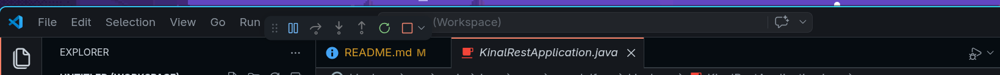
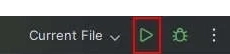
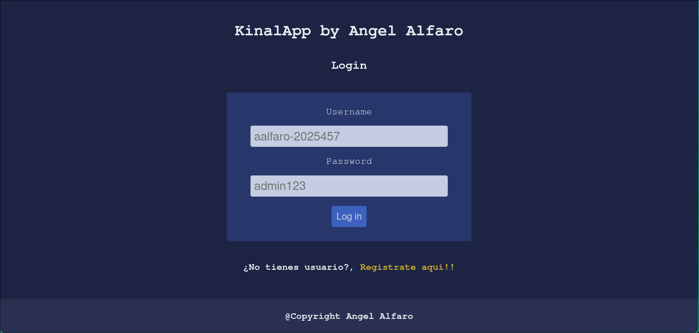
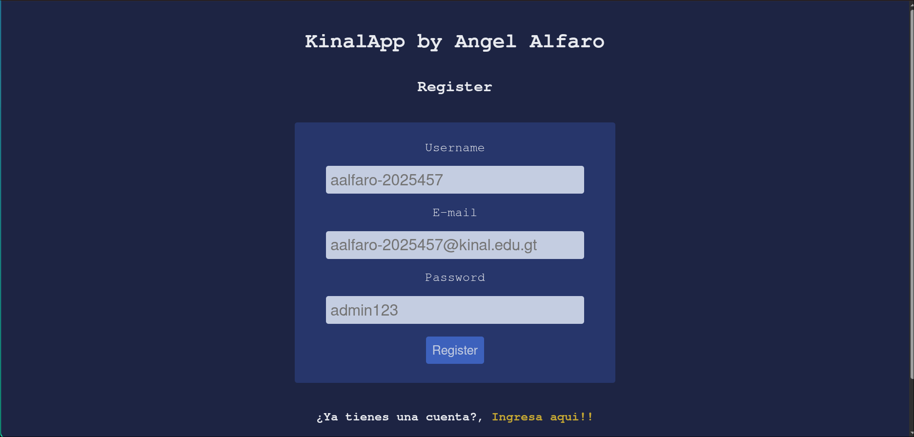
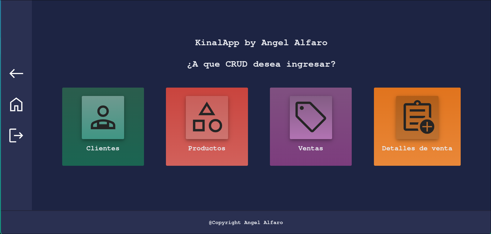
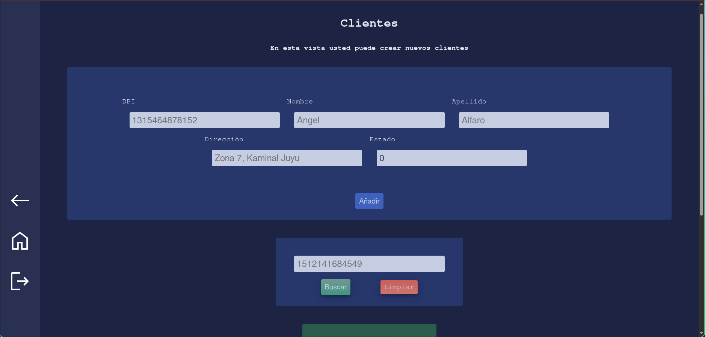
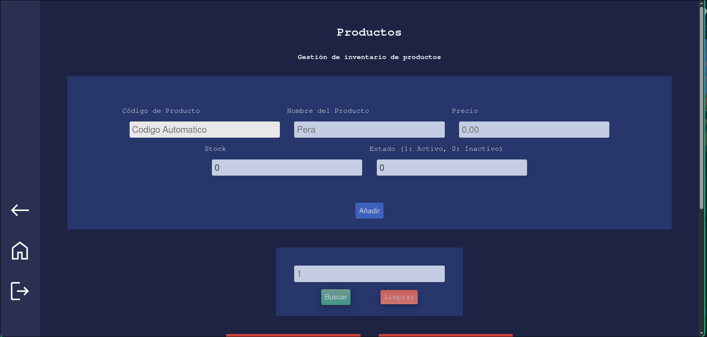
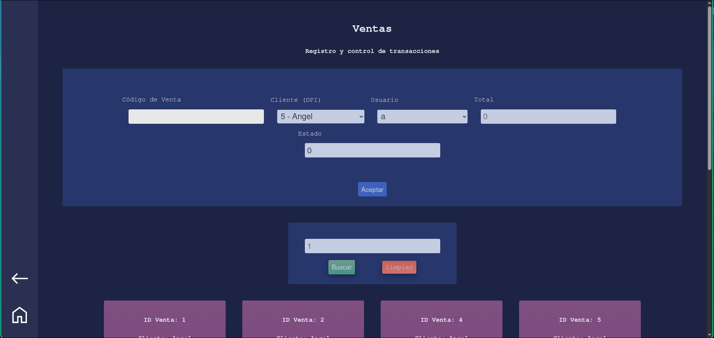
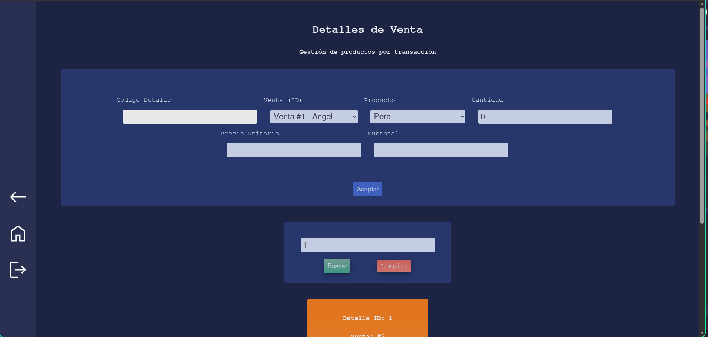

# kinalapp
Aplicacion web de gestion de compra y venta de productos
Utilizando una Api REST

## Tecnologias Utilizadas

* **Java 21**
* **SpringBoot 4.0.2**
* **SpringBoot Web**
* **MySQL** (Sistema Gestor de Base de Datos)
* **Maven** (Gestor de Dependencias)
* **Lombok**
* **SpringSecurity** (Sin uso real, solo permitimos el uso de todas las rutas y CORS)
* **Thymeleaf** (No hay uso todavia)

## Requisitos Previos

* Jdk 17 o superior
* Maven Instalado
* Instancia Activa de MySQL

## Introdución rapida

Instalacion y montaje de la aplicacion

``` bash
    git clone https://github.com/aalfaro-2025457/kinalapp.git

    git checkout develop

    git pull origin develop
```

## Ejecución de la Aplicacion

### Ejecucion con el IDE

Usando un IDE como:
* **VsCode** (con extencion de Java)
* **Intellij Idea** (o **Intellij Idea Comunity**)
* **Apache NetBeans**
* Etc...

En estos **IDE's** sule haber un **boton** en el lado superior ya sea en el centro o al lado derecho para poder ejecutar el codigo





## Configuracion
Esta aplicacion ya esta configurada en el **application.properties**, asi que la base de datos, usuario y contraseña ya estan ahi (Lo correcto seria usar variables de entorno)

Tambien es importante mencionar que mi aplicaion ya tiene **SpringSecurity** en las dependencias, por lo que para hacer mas sencilla la prueba de los endpoints, la seguridad de las rutas fue modificada para que cualquiera pueda usarlas, tambien se configuro csrf **CORS** para usar **Postman web**

## EndPoints
En esta seccion se explicara el **uso**, las **respuestas** y como es cada **endpoint** de los controladores

### ClientController

#### GET `http://localhost:8081/clients`
EndPoint para obtener la lista completa de **Clientes** registrados en la base de datos, devuelve **status** `200 OK` y la lista de Clientes.

#### GET `http://localhost:8081/clients/actives`
EndPoint para obtener únicamente la lista de **Clientes** con estado activo, devuelve **status** `200 OK` y la lista filtrada.

#### GET `http://localhost:8081/clients/{DPIClient}`
EndPoint que busca y devuelve un **Cliente** específico mediante su **DPI**, devuelve **status** `200 OK` si se encuentra o `404 Not Found` si no existe en los registros.

#### POST `http://localhost:8081/clients`
Sirve para registrar un nuevo **Cliente** en el sistema, transformando el JSON del cuerpo en un objeto. Devuelve **status** `201 Created` y el Cliente creado, o `400 Bad Request` si los datos son inválidos.

##### Objeto a Enviar

``` json
{
    "DPIClient": "1",
    "direction": "Kaminal Juyu, Guatemala",
    "lastNameClient": "Alfaro",
    "nameClient": "Angel",
    "state": 1
}

```

#### DELETE `http://localhost:8081/clients/{DPIClient}`
Sirve para eliminar un **Cliente** de la base de datos utilizando su **DPI**, devuelve **status** `204 No Content` tras una eliminación exitosa o `404 Not Found` si el DPI no coincide con ningún registro.

#### PUT `http://localhost:8081/clients/{DPIClient}`
EndPoint para actualizar la información de un **Cliente** existente mediante su **DPI**, devuelve **status** `200 OK` con el objeto actualizado, `400 Bad Request` por errores de validación o `404 Not Found` si el cliente no existe.
### **UserController**

#### GET `http://localhost:8081/users`
EndPoint para obtener la lista de todos los **Usuarios** registrados en el sistema, devuelve **status** `200 OK` y la lista de Usuarios.

#### GET `http://localhost:8081/users/state/{state}`
EndPoint para obtener todos los **Usuarios** filtrados por su estado (ej. baneado = 6, inactivo = 3), devuelve **status** `200 OK` y la lista de Usuarios que coinciden.

#### GET `http://localhost:8081/users/{codeUser}`
EndPoint que devuelve el **Usuario** encontrado con el **codeUser** en la base de datos, devuelve **status** `200 OK` o `404 Not Found` si no existe.

#### POST `http://localhost:8081/users`
Sirve para añadir un nuevo **Usuario** a la base de datos, devuelve **status** `201 Created` y el Usuario. En caso de error en los datos, devuelve `400 Bad Request`.

##### Objeto a Enviar
``` json
{
    "usernameUser":"wotzoy",
    "passwordUser":"admin123",
    "emailUser":"wotzoy-2025592@kinal.edu.gt",
    "rolUser":"USER",
    "stateUser":1
}
```


#### DELETE `http://localhost:8081/users/{codeUser}`
Sirve para eliminar un **Usuario** en la base de datos con el **codeUser**, devuelve **status** `204 No Content` o `404 Not Found` si el usuario no existe.

#### PUT `http://localhost:8081/users/{codeUser}`
EndPoint para actualizar un **Usuario** ya existente en la base de datos con el **codeUser**, devuelve **status** `200 OK` y el Usuario actualizado, o `400 Bad Request` si hay errores de validación.

### **ProductController**

#### GET `http://localhost:8081/products`
EndPoint para obtener la lista de todos los **Productos** en la base de datos, devuelve **status** `200 OK` y la lista de Productos.

#### GET `http://localhost:8081/products/state/{state}`
EndPoint para obtener todos los **Productos** filtrados por su estado (ej. disponible, agotado, descontinuado), devuelve **status** `200 OK` y la lista de Productos que coinciden.

#### GET `http://localhost:8081/products/{codeProduct}`
EndPoint que devuelve el **Producto** encontrado con el **codeProduct** en la base de datos, devuelve **status** `200 OK` o `404 Not Found` si no existe.

#### POST `http://localhost:8081/products`
Sirve para añadir un nuevo **Producto** a la base de datos, devuelve **status** `201 Created` y el Producto creado. En caso de error en los datos, devuelve `400 Bad Request`.

##### Objeto a Enviar
``` json
{
    "nameProduct":"Jamon Chimex",
    "priceProduct": 14.5,
    "stockProduct":50,
    "stateProduct":1
}
```


#### DELETE `http://localhost:8081/products/{codeProduct}`
Sirve para eliminar un **Producto** en la base de datos mediante el **codeProduct**, devuelve **status** `204 No Content` o `404 Not Found` si el producto no existe.

#### PUT `http://localhost:8081/products/{codeProduct}`
EndPoint para actualizar un **Producto** ya existente en la base de datos con el **codeProduct**, devuelve **status** `200 OK` y el Producto actualizado, o `400 Bad Request` si los datos son inválidos.

### **SaleController**

#### GET `http://localhost:8081/sales`
EndPoint para obtener la lista de todas las **Ventas** registradas en la base de datos, devuelve **status** `200 OK` y la lista de Ventas.

#### GET `http://localhost:8081/sales/state/{state}`
EndPoint para obtener todas las **Ventas** filtradas por su estado (ej. completada, pendiente, cancelada), devuelve **status** `200 OK` y la lista de Ventas que coinciden con el estado.

#### GET `http://localhost:8081/sales/{codeSale}`
EndPoint que devuelve la **Venta** encontrada con el **codeSale** en la base de datos, devuelve **status** `200 OK` o `404 Not Found` si no existe.

#### POST `http://localhost:8081/sales`
Sirve para registrar una nueva **Venta** en la base de datos, devuelve **status** `201 Created` y el objeto de la Venta. En caso de error en los datos, devuelve `400 Bad Request`.

##### Objeto a Enviar
``` json
{
    "totalSale":29,
    "stateSale":1,
    "clientSale":{
        "DPIClient":"15"
    },
    "userSale":{
        "codeUser":1
    }
}
```

#### DELETE `http://localhost:8081/sales/{codeSale}`
Sirve para eliminar una **Venta** en la base de datos mediante el **codeSale**, devuelve **status** `204 No Content` o `404 Not Found` si la venta no existe.

#### PUT `http://localhost:8081/sales/{codeSale}`
EndPoint para actualizar una **Venta** ya existente en la base de datos con el **codeSale**, devuelve **status** `200 OK` y la Venta actualizada, o `400 Bad Request` si la petición es inválida.

### **DetailSaleController**

#### GET `http://localhost:8081/detail-sales`
EndPoint para obtener la lista de todos los **Detalles de Venta** en la base de datos, devuelve **status** `200 OK` y la lista de los detalles.

#### GET `http://localhost:8081/detail-sales/state/{state}`
EndPoint para obtener todos los **Detalles de Venta** filtrados por su estado, devuelve **status** `200 OK` y la lista de registros que coinciden.

#### GET `http://localhost:8081/detail-sales/{codeDetailSale}`
EndPoint que devuelve el **Detalle de Venta** encontrado con el **codeDetailSale** en la base de datos, devuelve **status** `200 OK` o `404 Not Found` si no existe.

#### POST `http://localhost:8081/detail-sales`
Sirve para añadir un nuevo **Detalle de Venta** (desglose de productos de una venta) a la base de datos, devuelve **status** `201 Created` y el objeto creado. En caso de error, devuelve `400 Bad Request`.

##### Objeto a Enviar
``` json
{
    "amountDetailSale":1,
    "unitPriceDetailSale":29,
    "subtotal":29,
    "stateDetailSale":1,
    "productDetailProduct":{
        "codeProduct":3
    },
    "saleDetailSale":{
        "codeSale":3
    }
}
```


#### DELETE `http://localhost:8081/detail-sales/{codeDetailSale}`
Sirve para eliminar un **Detalle de Venta** en la base de datos mediante el **codeDetailSale**, devuelve **status** `204 No Content` o `404 Not Found` si el registro no existe.

#### PUT `http://localhost:8081/detail-sales/{codeDetailSale}`
EndPoint para actualizar un **Detalle de Venta** ya existente con el **codeDetailSale**, devuelve **status** `200 OK` y el detalle actualizado, o `400 Bad Request` si los datos son incorrectos.

## Views

En esta sección estaran unas imagenes de cada una de las vistas

### Login View


### Register Views


### Home View


### Clients View


### Products View


### Sales View


### Detal-Sales Views


## Spring Security

Se ha configurado exitosamente **Spring Security** en el proyecto **Kinal App**. Ya no puedes ingresar a las vistas crud/* ni a la vista home, si no estas logueado. Tambien en caso de no estar logueado puedes ir a la vista de register y a la vista de login. El boton logout en todas las vistas que lo poseen es completamente funcional y cierra la sesion con exito.